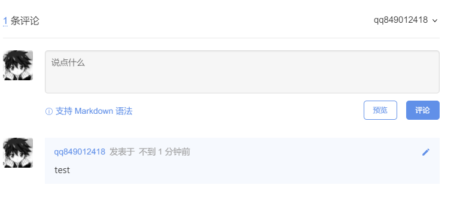

曾经有段时间gitalk用不了了，很失落，今天终于找到并解决了这个问题，很开心！

------

## 参考链接

- [gitalk](https://github.com/gitalk/gitalk)
- [有422，401，加载不成功等问题的可以参考一下我 #385](https://github.com/gitalk/gitalk/issues/385)

# Gitalk

Gitalk 是一个基于 GitHub Issue 和 Preact 开发的评论插件。

## 特性

- 使用 GitHub 登录
- 支持多语言 [en, zh-CN, zh-TW, es-ES, fr, ru]
- 支持个人或组织
- 无干扰模式（设置 distractionFreeMode 为 true 开启）
- 快捷键提交评论 （cmd|ctrl + enter）

## 配置方法

访问这个[网址](https://github.com/settings/applications/new)，填写第三方应用登记表。

注意！！！

为了防止后期的401错误，配置oAuth的时候Authorization callback URL要你博客打开的url，要干净的域名比如我下图所示的，最后面删掉/
owner要正确


新建完成后大概是这个样子


在config.yml中添加

```css
gitalk:
    owner: qq849012418
    repo: BlogTalk 
    clientID: 
    clientSecret: 

```

owner填自己的github号

repo需要建一个同名空仓库，专门用来放评论

clientID: clientSecret:填上面oauthapp获得的号

在_include文件夹下新建一个comments.html的文件，这里仅贴出gitalk相关的部分。使用html可以方便您修改好格式后引入到任何页面中。这里的css目录因为本人使用了cdn加速（防止远程地址更换），所以地址如下，普通使用的话改成<link rel="stylesheet" href="https://cdn.jsdelivr.net/npm/gitalk@1/dist/gitalk.css">即可

```html

        <div id="gitalk-container"></div>
        <!-- <link rel="stylesheet" href="https://cdn.jsdelivr.net/npm/gitalk@1/dist/gitalk.css"> -->
        <link rel="stylesheet" href="{{ site.cdnurl }}/assets/vendor/gitalk/gitalk.css">
        <script src="https://cdn.jsdelivr.net/npm/gitalk@1/dist/gitalk.min.js"></script>
        <script>
        var gitalk = new Gitalk({
            id: '{{ page.url | truncate: 50, '' }}',
            clientID: '{{ site.gitalk.clientID }}',
            clientSecret: '{{ site.gitalk.clientSecret }}',
            repo: '{{ site.gitalk.repo }}',
            owner: '{{ site.gitalk.owner }}',
            admin: ['{{ site.gitalk.owner }}'],
            labels: ['gitment'],
            perPage: 50,
        });
        gitalk.render('gitalk-container');
        </script>

```

把这个html在任何其他html页面引用的格式为


## 效果

支持markdown语法，真的太香了

